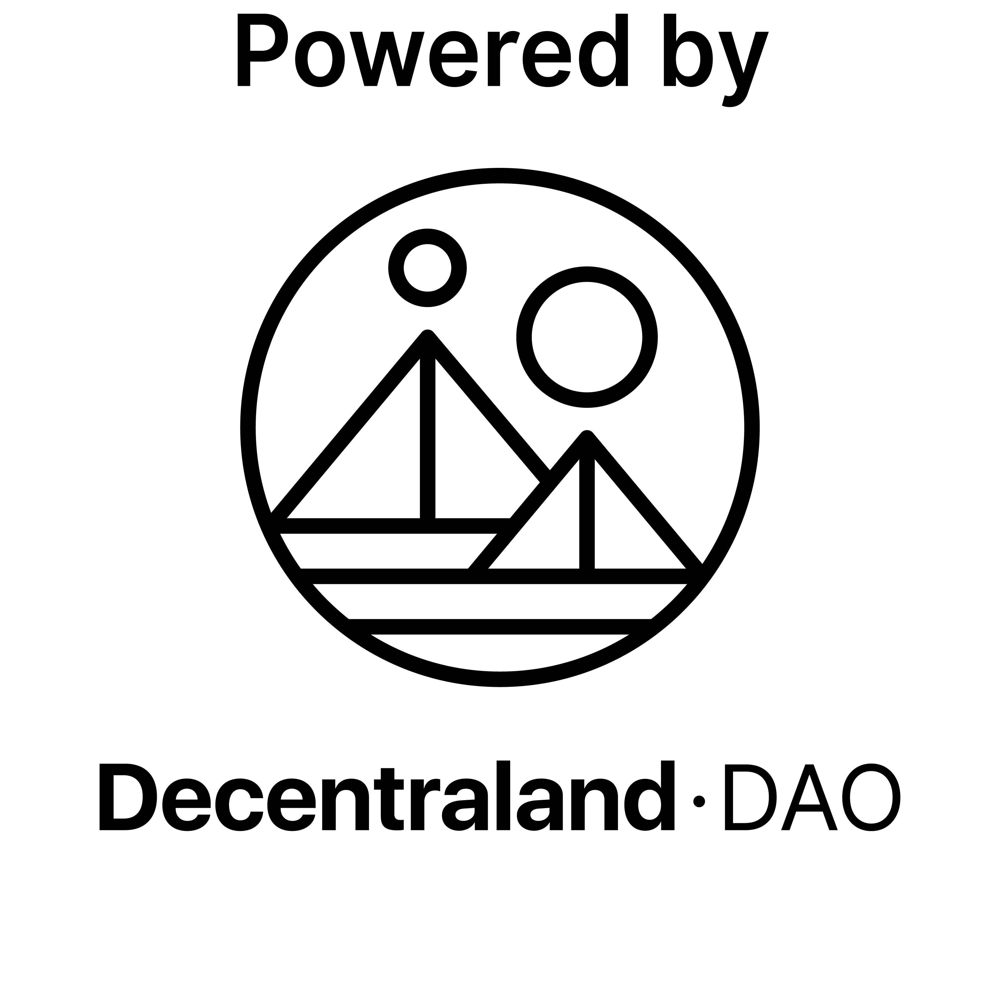

# Decentraland In-world Browser (experimental)

---

## Table of Contents
- [Introduction](#Introduction)
- [Features](#features)

## Introduction
This project is a Decentraland SDK scene that **embeds a web browser within the virtual environment**.
The browser is executed and rendered from a server, then in Decentraland we can see and interact with it, the method is similar to VNC client/server.


## Features
- **Shared session**: multiples players can see the same browser state.
- **User Locking**: When someone uses the browser it's locked for that user for 30 seconds.
- **Link detection** When a browser should open a new TAB, instead a dialog will be shown to navigate out of Decentraland.
- **Multiple instances** We can have different
- **Click interactivity** 
- **Changes detection** It notifies when a change in view has hapenned
- **Compression** Images are encoded for faster transfer
- **Url bar**
- **Status bar**
- **Reconnection** if server is down, the browser will connect automatically when server is back up.
- **Decentraland Link detection** Detects Decentraland places links and offer teleport


## How to add in your scene using SDK-7
First install the npm library in your scene folder
```
npm install @zeroxwork/decentraland-browser-client
```
Then you can add the import and instantiate the browser component with configuration parameters
```typescript
import {createVirtualBrowserClient} from "@zeroxwork/decentraland-virtual-browser-client";

const SERVER_BASE_URL = "https://dcl-browser.zeroxwork.com";
const WEBSOCKET_URL = "wss://dcl-browser.zeroxwork.com";

 createVirtualBrowserClient({
    colyseusServerURL:WEBSOCKET_URL,
    baseAPIURL:SERVER_BASE_URL,
    position:Vector3.create(2, 2, 8),
    rotation:Quaternion.fromEulerDegrees(0,0,0),
    scale:Vector3.create(3,768/1024 * 3,1),
    homeURL:"https://decentraland.org/governance",
    parent:undefined //it can have a parent Entity
  });
```

## How to run your own server
The easiest way is to run it with docker, you can find docs about docker here: https://www.docker.com/get-started/ 

Once you have docker in your computer you can just run the script `build-docker-and-run.sh` if you are a UNIX like user. 
For windows users look the commands executed in the script:
```
# Build the Docker image
docker build -t dcl-browser .
docker stop dcl-browser-container
docker rm dcl-browser-container
# Run the container based on the built image
docker run --env-file .env --rm -d --name dcl-browser-container -p 3000:3000 dcl-browser

docker logs dcl-browser-container --follow
```
### ⚠️ Note using docker:
The server uses **puppeteer** with chromium headless, depending on the architecture of your computer CPU (Apple M1, Intel, ...) the installation directory for chromium can vary, then we would need to set the env var PUPPETEER_EXECUTABLE_PATH with the absolute path to the chromium executable. You can set this on .env file

#### Note: this project has been support by the Decentraland DAO
